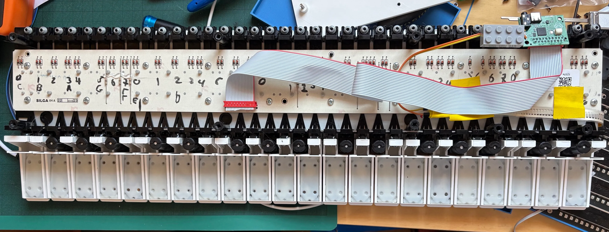

# miniboard - a super minimal fatar tp9 37 key keybed scanner using an rp2040 mcu by @mmalex.bsky.social

August 2026

## the keybed wot you need

there's no point looking at this project until you are the proud owner of a fatar 9s keybed. probably the 37 key variant. 

- the keybed - https://www.fatar.com/products/tp9s/
- datasheet - https://www.antonus-synths.com/enlo-1/fatar/DataSheet-TP9S%2BP.pdf

I got mine at great expense a few years ago from
https://enlo-1.com/products/fatar-tp-9s-keyboard
but im not sure if they are meant to sell them to us hobbyists? either way it was expensive for what it is! maybe you can find one cheaper somewhere else. I am not affiliated with them in any way, just documenting my build.

## whence came this mess

forked from my earlier 2024 zacboard project, that included an oled, 2 encoders, and a silly set of i2c slider boards that allowed it to sport more sliders than keys.

im not sure if i ever released that one publically (* i did not), but i was curious about making a super minimal 'fatar keybed and nothing else' the other day, so I stripped everything down, speed-designed a PCB, and re-ordered from JLC. the boards just arrived, they work, I am putting this up on github before thinking too much...

## software

the software just times make/breaks when scanning the keybed, as one must, and uses that to pick a velocity.

it also feeds the aftertouch resistor to ADC0 and uses that to generate aftertouch events.

it sends MIDI messages out on channel 0 on the TRS port and over usb midi. I just realised I haven't really tested the USB midi yet, but it's based on old code and it compiles so... yeah it's fine.

the pcb has a 3 pin connector for a raspberry pi debug probe 

https://www.raspberrypi.com/products/debug-probe/

which I highly recommend for all rp2040 hacking projects. it gives you quick way to flash new software without messing with reset buttons, clean debugging in vscode, watch, breakpoints, etc.

i set this project to use rtt segger style printf, which is THE ONE TRUE WAY but is surprisingly underdocumented in the pico sdk. If you have a probe connected you can
see your printf's in vscode via the TERMINAL tab, and its really cheap, and doesnt tie up the USB port or a 
serial port, nor use any GPIOs. lovely!

## hardware

power is over usb-c obviously

i did this in a yolo rush, so its a bit rough.
ordering your own pcbs, its the usual kicad -> jlcpcb -> yay!
I even left the production files checked in, so you could even just upload those straight to JLC. it worked for me, but see the section below on improvements you might want to make before spending money.

all the parts should be readily available via their assembly service.

I accept no responsibility for anything that may come from building this stuff! you're on your own.

## mounting

the open scad file is for a simple plank to screw onto the keybed and mount the circuit board.

a plank of wood or other material would be nicer.

i screwed it into the keybed with 8 wood screws i found in a cupboard :) M3 or M4 I think they were.
the pcb has two m3 holes in it, which I used 2 M3 machine screws and nuts for. the stl/openscad file has holes for these.

## keybed connector

i HATE HATE HATE the minimatch connector that fatar uses, but here we are. you need some 20 way
ribbon cable to clamp it onto, which requires FORCE which often breaks the fragile plastic.
I got the connectors from digikey:

| use | quantity | digikey part | manufacturer | manufacturer part | description |
| --- | ---: | --- | --- | --- | --- |
| for the cable... | 2x | A99456CT-ND | TE CONNECTIVITY AMP (VA) | 9-215083-0 | CONN PLUG 20POS IDC 28AWG TIN |
| for the pcb... | 1x | A99465CT-ND | TE CONNECTIVITY AMP (VA) | 9-215079-0 | CONN RCPT 20POS 0.1 TIN PCB |

and standard 28AWG 20 way ribbon cable.

The keybed also has a little flat flex variable resistor. connect two wires to it
and solder them to the outer two pins of the 4 pin connector on the pcb. voila,
after touch.

## PCB design mistakes chapter:

* i should have connected the last 2 pins to GPIOs. I didn't. as a result you can't scan larger keyboards.
If i was ordering from JLCPCB again, I'd hook up those two not connected pins to GPIOs.

* the TRS jack for midi is too close to the USB-C. it works, but its close.

* obviously it could sprout more connections, encoders, buttons, etc.... but that wasnt the point of 
this minimalist project.  

* it would make sense to expose more of the free GPIOs as testpads or connectors or whatnot.

* the routing is fine, honest.

## license

released into as liberal a license as I can: [CC0](LICENSE.md)...

- alex 'mmalex' evans august 2026 
